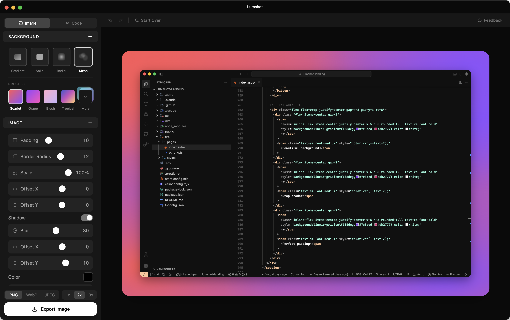
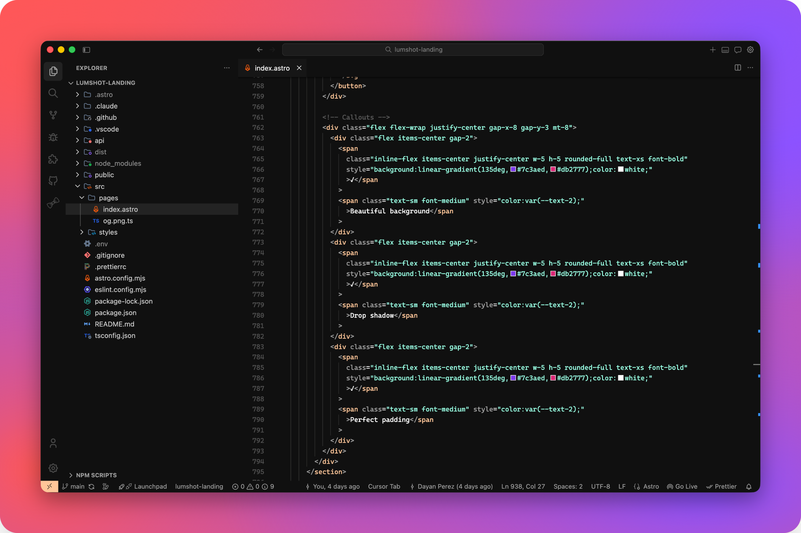

<div align="center">

# Lumshot

**Turn any image into something beautiful.**

[](https://nodejs.org/)
[](https://www.typescriptlang.org/)
[](https://www.electronjs.org/)
[](./LICENSE)

[Quick start](#quick-start) · [Scripts](#scripts) · [Tech stack](#tech-stack) · [Contributing](#contributing) · [Changesets](#changesets) · [License](#license) · [CI workflow](https://github.com/ayaxsoft/Lumshot/actions/workflows/ci.yml)





</div>

## Quick start

You need **Node.js 22+** and **npm 10+**.

```bash
git clone git@github.com:ayaxsoft/lumshot.git
cd lumshot
npm install
npm run dev
```

## Scripts

### Development

- `npm run dev` — app with HMR
- `npm run preview` — preview the production build

### Build

- `npm run build` — typecheck, Vite build, and `electron-builder`

### Quality

- `npm run lint` — ESLint
- `npm run format` — Prettier (write)
- `npm run format:check` — Prettier (check only)
- `npm run typecheck` — `tsc --noEmit`
- `npm run test` — Vitest
- `npm run test:ui` — Vitest with UI

### Release (Changesets)

- `npm run changeset` — add a changeset
- `npm run changeset:version` — bump versions from changesets
- `npm run changeset:publish` — publish from changesets

## Tech stack

Electron desktop app built with **electron-vite** and **Vite**. UI in **React** and **TypeScript**, styled with **Tailwind CSS v4** and **Radix UI**. State with **Zustand** and **Immer**. Image work in the main process via **Sharp**. Tests with **Vitest**, **Testing Library**, and **happy-dom**.

## Contributing

1. Branch from `main`.
2. Implement your changes and add a **changeset** when the PR should drive a release (see [Changesets](#changesets)).
3. Push and open a PR targeting `main`. On pull requests, CI runs `npx changeset status --since=origin/main` so the changeset is not forgotten.

## Changesets

Feature and fix PRs should include a changeset that describes what users get. That is the contract that keeps **version bumps** and **CHANGELOG.md** honest.

### Typical PR flow

1. Work on your branch.
2. Run `npx changeset`. It asks for the bump type:
   - **patch** — bug fix (`0.0.X`)
   - **minor** — new feature (`0.X.0`)
   - **major** — breaking change (`X.0.0`)
3. Edit the generated markdown file under `.changeset/` so the summary matches the change.
4. Commit that file together with your code.
5. CI checks that a changeset exists for the PR (see the **changeset** job in the workflow).

### After merge to `main`

Release maintainers run:

- `npx changeset version` — applies pending changesets: updates `package.json` (and related manifests) and writes **CHANGELOG.md**.
- `npx changeset publish` — publishes to npm (or your registry). **This repo does not ship to npm**, so you may skip publish; the important part for history here is `changeset version`, which records versions and changelog entries.

### Chores, docs, and CI-only work

When nothing should appear in the changelog, add an empty changeset so CI still passes:

```bash
npx changeset add --empty
```

## License

[Lumshot](https://github.com/ayaxsoft/lumshot) is released under the [MIT License](LICENSE). Copyright © 2025 Ayaxsoft.
